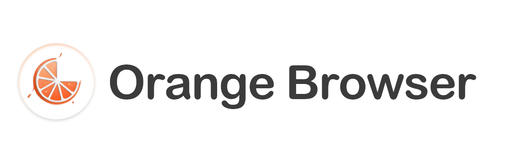
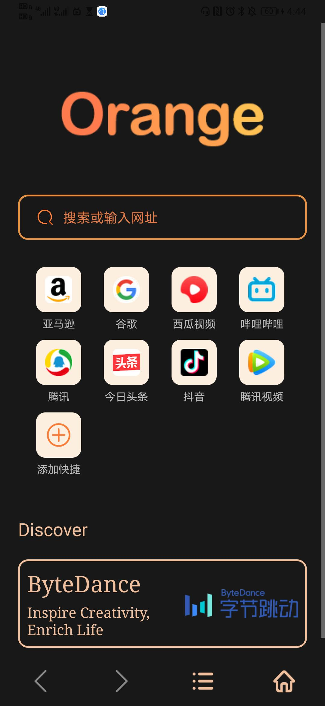
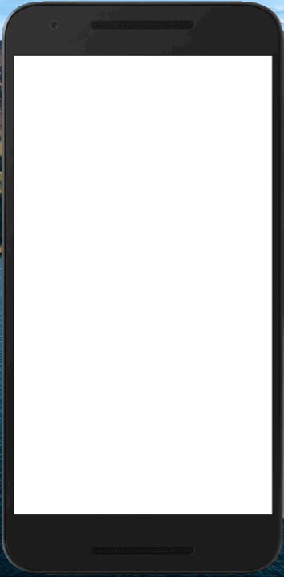

### [English](https://github.com/HeXavi8/Orange-Browser) | 中文
# 

“橘子浏览器”是字节跳动与华南理工大学联合举办的为期六周实训项目中开发的一款android应用程序。


## 目录
* [截图](#Snapshots)
* [功能](#Functions)
* [使用](#Usage)
* [文档](#Documentations)
* [设计](#Design)
* [项目成员](#Project_Members)
* [动图](#Gifs)
* [License](#License)


## 截图 <a name="Snapshots"></a>

&emsp;

## 功能 <a name="Functions"></a>

* 书签
* 历史
* 快速页面
* 用户管理(注册、登录、信息变更)
* 无痕浏览模式
* 夜间模式
* 多媒体(视频播放&照片浏览&照片下载)
* 搜索

## 使用 <a name="Usage"></a>

请克隆该仓库，并在Android Studio运行。

Gradle 版本:
```
distributionUrl=https\://services.gradle.org/distributions/gradle-6.7.1-all.zip
```
依赖:
```
dependencies {
    implementation 'com.github.bumptech.glide:glide:4.8.0'
    annotationProcessor 'com.github.bumptech.glide:compiler:4.8.0'
    implementation fileTree(dir: "libs", include: ["*.jar"])
    implementation 'androidx.appcompat:appcompat:1.2.0'
    implementation 'com.android.support:appcompat-v7:21.0.3'
    implementation 'androidx.constraintlayout:constraintlayout:2.0.4'
    implementation 'com.github.chrisbanes:PhotoView:2.0.0'
    implementation 'org.greenrobot:greendao:3.3.0'
    implementation 'androidx.recyclerview:recyclerview:1.1.0'
    implementation 'org.jetbrains:annotations:15.0'
    testImplementation 'junit:junit:4.12'
    androidTestImplementation 'androidx.test.ext:junit:1.1.2'
    androidTestImplementation 'androidx.test.espresso:espresso-core:3.3.0'
    }
```

## 文档 <a name="Documentations"></a>
* [需求调研与分析文档](https://gmja06lqlv.feishu.cn/docs/doccnHKdKTbgC3bJ3vR0YWX3pdh#)
* [交互设计文档](https://gmja06lqlv.feishu.cn/docs/doccnL7AnOJU59VLdlAdy6n4DXc#)
* [技术设计文档](https://gmja06lqlv.feishu.cn/docs/doccnA3Ya4Bk4qzcJY2D772wJcb#)

## 设计 <a name="Design"></a>


我们的Logo和用户界面设计是由 [Zixuan](https://github.com/coddlly) 和 [Xavi](https://github.com/HeXavi8) 完成的。

## 项目成员 <a name="Project_Members"></a>

- [Xavi](https://github.com/HeXavi8) - **Xavi He** &lt; 825308876@qq.com&gt; (he/him)
- [Li Xiaofei](https://github.com/Makka-Pakka111) - **Li Xiaofei** &lt;1040314319@qq.com&gt; (she/her)
- [Walden](https://github.com/Aoliao-w) - **Walden** &lt;1215454179@qq.com&gt; (she/her)
- [Zixuan](https://github.com/coddlly) - **Zixuan** &lt;1906377395@qq.com&gt; (she/her)

我们的代码和设计远非完美。如果您有任何建议或想贡献代码，请随时联系我们或作出拉请求。 </br>

## 动图
&emsp;&emsp;&emsp;&emsp;

## License <a name="License"></a>
[Apache-2.0 License](./LICENSE)
